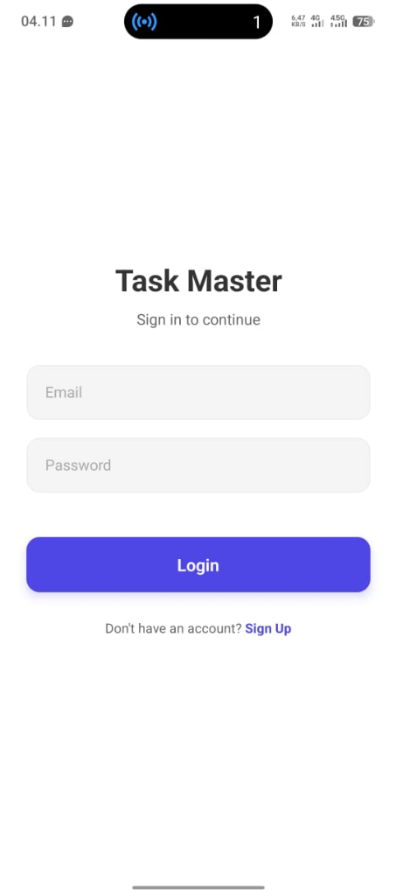
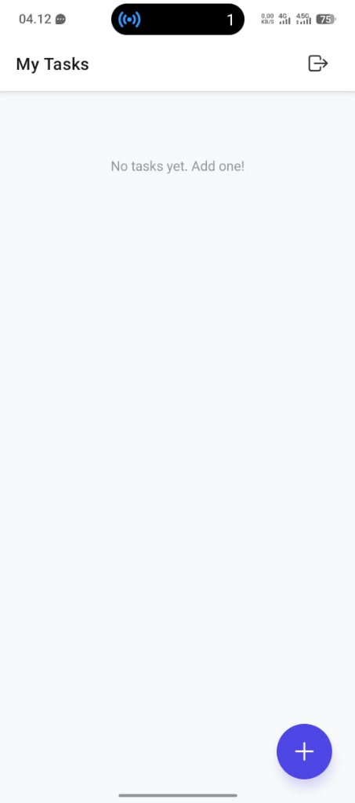
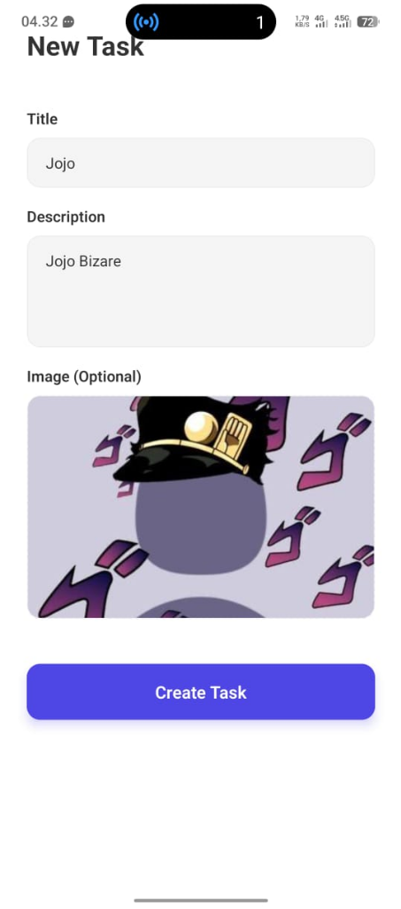
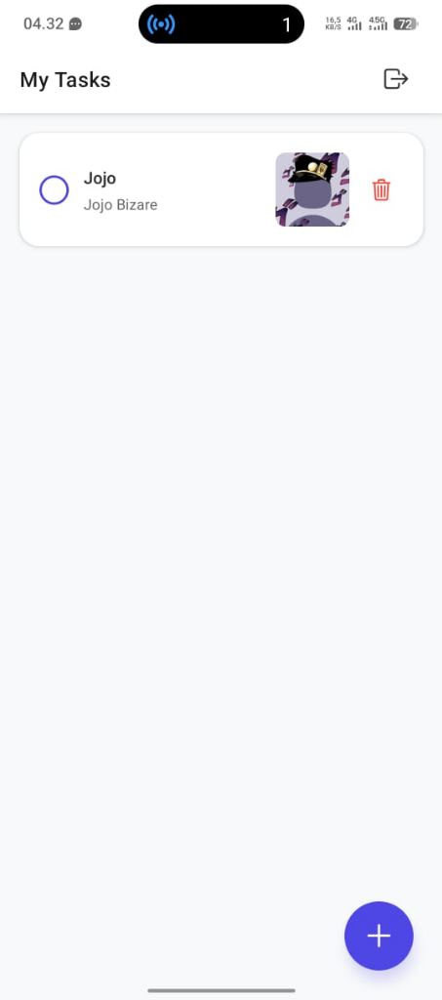

# Task Master - Todo App (React Native Expo + Firebase)

Aplikasi manajemen tugas (Todo List) sederhana yang dibangun menggunakan **React Native Expo** dan terintegrasi dengan **Firebase** untuk autentikasi dan penyimpanan data real-time.

Aplikasi ini dibuat untuk memenuhi tugas mata kuliah Pemrograman Perangkat Bergerak (Mobile Programming).

## 📱 Fitur Utama

1.  **Authentication**: Login dan Register menggunakan Email & Password (Firebase Auth).
2.  **Create Task**: Menambahkan tugas baru dengan Judul, Deskripsi, dan Gambar.
3.  **Read Task**: Menampilkan daftar tugas secara Real-time (Firestore Snapshot).
4.  **Update Status**: Menandai tugas sebagai Selesai (Done) atau Belum Selesai (Undone).
5.  **Delete Task**: Menghapus tugas dari database.
6.  **Image Attachment**: Menyertakan foto pada setiap tugas.

## 🛠 Teknologi yang Digunakan

- **Front-end**: React Native, Expo SDK 54
- **Back-end**: Firebase (Google)
  - Authentication
  - Cloud Firestore
  - Cloud Storage
- **Libraries**:
  - `expo-image-picker`: Untuk mengambil gambar.
  - `react-navigation`: Untuk navigasi antar layar.

## 📸 Screenshots

Berikut adalah tampilan antarmuka aplikasi:

|                    Login Screen                     |                        Empty Home                        |                        Add Task                        |
| :-------------------------------------------------: | :------------------------------------------------------: | :----------------------------------------------------: |
|  |  |  |
|                  **Halaman Login**                  |                    **Beranda Kosong**                    |                    **Tambah Tugas**                    |

<br>

|                        Task List                        |                      Task Finished                      |
| :-----------------------------------------------------: | :-----------------------------------------------------: |
|  |  |
|                    **Daftar Tugas**                     |                    **Tugas Selesai**                    |

## 🚀 Cara Menjalankan Project

1.  **Clone Repository**

    ```bash
    git clone https://github.com/username/todo-app.git
    cd todo-app
    ```

2.  **Install Dependencies**

    ```bash
    npm install
    ```

3.  **Setup Firebase**

    - Buat project di Firebase Console.
    - Salin konfigurasi web ke file `firebaseConfig.js`.
    - Aktifkan Auth, Firestore, dan Storage.

4.  **Jalankan Aplikasi**
    ```bash
    npx expo start
    ```

---

© 2026 Task Master Project
